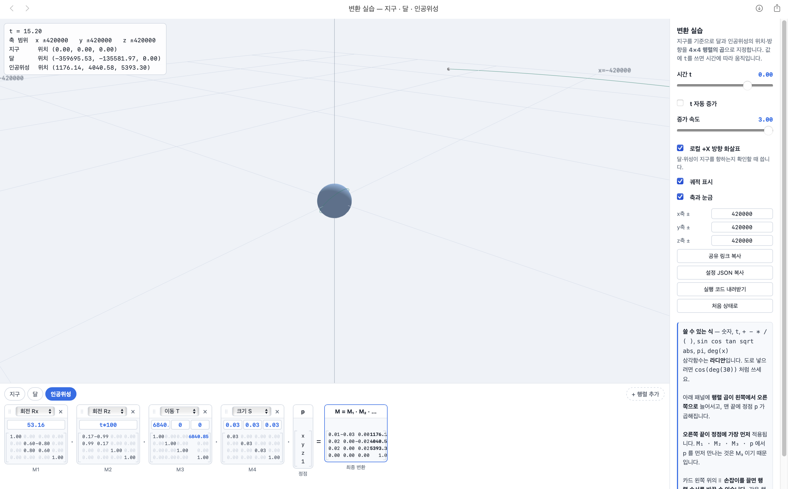
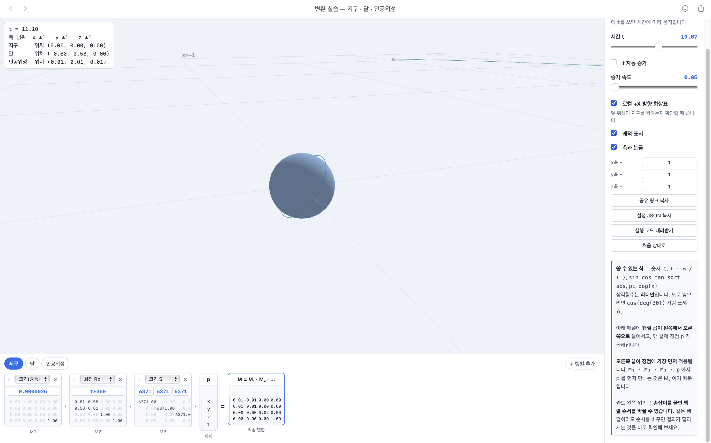
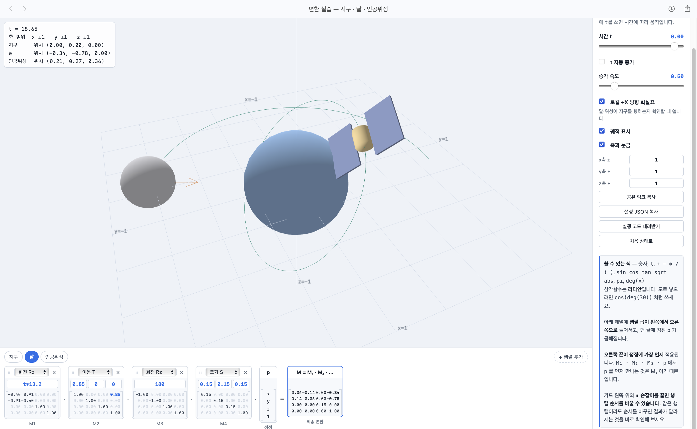

# 2주차 과제: 변환과 행렬 (지구, 달, 인공위성의 변환 설계)

## 사전 질문: 순서를 바꿔 보고 답해 보세요

1. T를 Rz 앞으로 옮기면(T · Rz · p) 달의 움직임이 어떻게 달라지나요?
- 달이 지구 주변을 돌지 않고 제자리에서 자전만 하게 됩니다. 행렬 곱은 오른쪽부터 적용되기 때문에 T · Rz 순서로 두면 물체가 원점에서 먼저 돌고 난 뒤에 바깥 궤도로 이동해서 멈추기 때문입니다. 반대로 Rz · T 순서로 배치해야 먼저 거리만큼 나간 뒤 원점을 축으로 회전하면서 공전과 조석 고정이 함께 일어납니다.

2. S(크기)를 맨 앞으로 옮기면(S · Rz · T · p) 무엇이 달라지나요? 달라지지 않는다면 그 이유는?
- 물체의 크기만 바뀌는 것이 아니라 이미 이동해 있는 위치 좌표까지 함께 확대/축소되면서 궤도 반경 전체가 틀어집니다. 크기 변환은 물체가 원점에 있을 때 적용해야 형태만 줄어들기 때문에 항상 이동(T) 전인 p 바로 앞에 두어야 합니다.

3. 세 행렬을 배열하는 방법은 6가지입니다. 그중 달의 공전을 올바르게 표현하는 것은 몇 가지인가요?
- 1가지입니다. 올바른 순서는 Rz · T · S · p 입니다. 크기를 먼저 줄이고(S), 궤도 거리만큼 밀어낸 뒤(T), 원점을 중심으로 공전 회전(Rz)을 주어야 궤도 크기를 유지하면서 지구를 바라보며 돌게 됩니다.

---

## Task 1 — 실제 비율로 만들기

### 1. 대상 인공위성 및 실제 수치 조사
satellitemap.space에서 실시간 TLE 궤도 데이터와 제원을 확인하여 대상 위성을 골랐습니다.

- 선정한 위성: Starlink 31114 (v2 mini)
- 출처: satellitemap.space
- 조사한 물리 수치:
  - 지구 반지름: 약 6,371 km
  - 달 반지름: 약 1,737 km
  - 지구-달 거리: 약 384,400 km
  - 위성 궤도 반지름(Semi-major Axis): 6,840.85 km (지표면 기준 고도는 약 470 km)
  - 위성 궤도 경사각(Inclination): 53.16도
  - 위성 공전 주기: 93.85분 (하루에 약 15.34바퀴 회전)
  - 위성 크기: 태양광 패널 전개 시 약 30 m (0.03 km)

### 2. Task 1 질문에 대한 답

1. 거리의 단위를 무엇으로 정했는가? 왜 그렇게 정했는가?
- 단위를 킬로미터(km)로 정했습니다. 지구와 달, 위성 궤도 데이터를 직관적으로 입력하기 가장 편한 단위이기 때문입니다. 만약 미터(m) 단위를 쓰면 지구-달 거리가 384,400,000 m로 1억 단위가 넘어가는데, WebGL GPU가 다루는 32비트 실수(float32)의 유효숫자가 7자리 안팎이라 반올림 오차가 생길 수 있어 6자리 안쪽으로 떨어지는 km 단위를 사용했습니다.

2. 숫자가 커서 생긴 문제가 있었는가? 있었다면 무엇인가?
- 축 범위를 달까지 다 보이도록 ±420,000 km로 크게 잡다 보니, 수십 미터에 불과한 인공위성 크기(0.03 km)와 고도가 화면상에서 1픽셀도 되지 않아 눈으로 전혀 보이지 않는 문제가 있었습니다.

3. 달·위성이 지구를 향하게 만든 것은 어느 변환 단계 덕분인가?
- Rz(공전) · T(거리) · p 결합 방식 때문입니다. 점을 거리만큼 밀어놓은 뒤 전체 좌표계를 원점 기준으로 돌려버리기 때문에, 물체의 로컬 방향축도 공전 궤도를 따라 같이 돌면서 항상 중심인 지구를 바라보게 됩니다.

### 3. 변환 입력값 전체와 설명

지구
- 회전 Rz (각도 t * 360): 하루에 한 바퀴 자전하는 것을 표현하기 위해 t에 360을 곱했습니다.
- 크기 S (6371, 6371, 6371): 도구 기본 구의 반지름이 1이라서 실제 지구 반지름인 6,371 km에 맞춰 스케일을 키웠습니다.

달
- 회전 Rz (각도 t * 13.2): 달의 공전 주기(약 27.3일)를 반영해 하루치 각도(360 / 27.3)를 계산해서 넣었습니다. 이동 전에 곱해져서 지구를 보며 공전하도록 만들었습니다.
- 이동 T (384400, 0, 0): 실제 지구-달 거리인 384,400 km만큼 X축으로 밀어서 궤도 반지름을 맞췄습니다.
- 크기 S (1737, 1737, 1737): 달 반지름 1,737 km를 반영하기 위해 먼저 크기를 조절했습니다.

인공위성 (Starlink 31114)
- 회전 Rx (각도 53.16): 위성의 실제 궤도 경사각 53.16도를 표현하기 위해 공전면 전체를 X축 기준으로 기울였습니다.
- 회전 Rz (각도 t * 100): 원래 주기는 93.85분이지만, 화면에서 너무 어지럽지 않게 움직임을 확인하려고 100배율을 적용했습니다.
- 이동 T (6840.85, 0, 0): TLE에 나온 지구 중심 기준 궤도 반지름 6,840.85 km만큼 이동시켰습니다.
- 크기 S (0.03, 0.03, 0.03): 위성 전개 크기인 30 m를 km 단위로 바꾼 0.03으로 지정했습니다.

## 4. 공유링크복사
https://cg.catholic.ac.kr/~mgchoi/CG/demos/d02-transform-lab.html?d=eyJyYW5nZSI6eyJ4IjoiNDIwMDAwIiwieSI6IjQyMDAwMCIsInoiOiI0MjAwMDAifSwib2JqZWN0cyI6W3siaWQiOiJlYXJ0aCIsIm5hbWUiOiLsp4DqtawiLCJjb2xvciI6WzAuMzUsMC42LDAuOTVdLCJzdGVwcyI6W3sidHlwZSI6IlJ6IiwiYXJncyI6WyJ0KjM2MCJdfSx7InR5cGUiOiJTIiwiYXJncyI6WyI2MzcxIiwiNjM3MSIsIjYzNzEiXX1dfSx7ImlkIjoibW9vbiIsIm5hbWUiOiLri6wiLCJjb2xvciI6WzAuNzgsMC43OCwwLjgyXSwic3RlcHMiOlt7InR5cGUiOiJSeiIsImFyZ3MiOlsidCoxMy4yIl19LHsidHlwZSI6IlQiLCJhcmdzIjpbIjM4NDQwMCIsIjAiLCIwIl19LHsidHlwZSI6IlMiLCJhcmdzIjpbIjE3MzciLCIxNzM3IiwiMTczNyJdfV19LHsiaWQiOiJzYXQiLCJuYW1lIjoi7J246rO17JyE7ISxIiwiY29sb3IiOlswLjk1LDAuNzIsMC4zNV0sInN0ZXBzIjpbeyJ0eXBlIjoiUngiLCJhcmdzIjpbIjUzLjE2Il19LHsidHlwZSI6IlJ6IiwiYXJncyI6WyJ0KjEwMCJdfSx7InR5cGUiOiJUIiwiYXJncyI6WyI2ODQwLjg1IiwiMCIsIjAiXX0seyJ0eXBlIjoiUyIsImFyZ3MiOlsiMC4wMyIsIjAuMDMiLCIwLjAzIl19XX1dfQ%3D%3D 
## 5. 설정JSON복사:
```json
{
  "range": {
    "x": "420000",
    "y": "420000",
    "z": "420000"
  },
  "objects": [
    {
      "id": "earth",
      "name": "지구",
      "color": [
        0.35,
        0.6,
        0.95
      ],
      "steps": [
        {
          "type": "Rz",
          "args": [
            "t*360"
          ]
        },
        {
          "type": "S",
          "args": [
            "6371",
            "6371",
            "6371"
          ]
        }
      ]
    },
    {
      "id": "moon",
      "name": "달",
      "color": [
        0.78,
        0.78,
        0.82
      ],
      "steps": [
        {
          "type": "Rz",
          "args": [
            "t*13.2"
          ]
        },
        {
          "type": "T",
          "args": [
            "384400",
            "0",
            "0"
          ]
        },
        {
          "type": "S",
          "args": [
            "1737",
            "1737",
            "1737"
          ]
        }
      ]
    },
    {
      "id": "sat",
      "name": "인공위성",
      "color": [
        0.95,
        0.72,
        0.35
      ],
      "steps": [
        {
          "type": "Rx",
          "args": [
            "53.16"
          ]
        },
        {
          "type": "Rz",
          "args": [
            "t*100"
          ]
        },
        {
          "type": "T",
          "args": [
            "6840.85",
            "0",
            "0"
          ]
        },
        {
          "type": "S",
          "args": [
            "0.03",
            "0.03",
            "0.03"
          ]
        }
      ]
    }
  ]
}
```
- 실행 페이지: [Task 1 실행하기](task1.html)

### 6. 결과 화면 캡처


---

## Task 2 — NDC 범위에 맞추기

### 1. 확인하고 답하기

1. s를 얼마로 정했고 그 값을 어떻게 계산했는가?
- s를 0.0000025로 정했습니다.
- 원점에서 가장 먼 지점은 달의 바깥쪽 끝(지구-달 거리 384,400 km + 달 반지름 1,737 km = 386,137 km)입니다. 이 지점이 NDC 범위인 1 안에 들어오려면 배율은 1 / 386,137 (약 0.00000259) 이하여야 합니다. 화면 끝에 닿아 잘리지 않도록 약 15% 여유를 두어 0.0000025로 설정했습니다.

2. 배율 행렬을 사슬의 맨 앞에 넣은 이유는 무엇인가? 맨 뒤에 넣으면 어떻게 되는가?
- 행렬 곱은 오른쪽부터 적용되기 때문에 맨 앞에 넣어야 이미 궤도 거리만큼 이동한 좌표까지 포함해 씬 전체가 원점 기준으로 줄어듭니다.
- 만약 맨 뒤(정점 쪽)에 넣으면 물체의 크기만 줄어들고 이동 거리는 그대로 유지되어 달이 여전히 NDC 화면(-1 ~ 1) 밖으로 벗어납니다.

3. 세 물체에 같은 배율을 쓴 이유는 무엇인가?
- 물체마다 다른 배율을 곱하면 지구, 달, 인공위성 간의 크기 비례와 거리 비례가 깨지기 때문입니다. 전체 장면에 동일한 배율을 적용해야 상대적 비례 관계를 온전히 유지할 수 있습니다.

4. 비율을 유지한 결과, 화면에서 지구와 인공위성은 어떻게 보이는가?
- 달 궤도 전체가 -1 ~ 1 화면 안에 들어오도록 축소했기 때문에 지구는 중심에 아주 작은 점 형태로 보이고, 인공위성은 크기와 고도가 너무 미세하여 지구 표면에 묻혀 육안으로 전혀 식별되지 않습니다.

### 2. 변환 입력값 설명

- 지구, 달, 인공위성 세 물체의 행렬 사슬 가장 앞(맨 왼쪽)에 공통으로 크기 S (0.0000025, 0.0000025, 0.0000025) 행렬을 추가했습니다. 기배치된 천체들의 상대적 위치와 크기를 보존하면서 장면 전체를 NDC 범위에 맞추기 위한 전역 스케일 변환입니다.

## 3. 공유링크복사
https://cg.catholic.ac.kr/~mgchoi/CG/demos/d02-transform-lab.html?d=eyJyYW5nZSI6eyJ4IjoiMSIsInkiOiIxIiwieiI6IjEifSwib2JqZWN0cyI6W3siaWQiOiJlYXJ0aCIsIm5hbWUiOiLsp4DqtawiLCJjb2xvciI6WzAuMzUsMC42LDAuOTVdLCJzdGVwcyI6W3sidHlwZSI6IlN1IiwiYXJncyI6WyIwLjAwMDAwMjUiXX0seyJ0eXBlIjoiUnoiLCJhcmdzIjpbInQqMzYwIl19LHsidHlwZSI6IlMiLCJhcmdzIjpbIjYzNzEiLCI2MzcxIiwiNjM3MSJdfV19LHsiaWQiOiJtb29uIiwibmFtZSI6IuuLrCIsImNvbG9yIjpbMC43OCwwLjc4LDAuODJdLCJzdGVwcyI6W3sidHlwZSI6IlN1IiwiYXJncyI6WyIwLjAwMDAwMjUiXX0seyJ0eXBlIjoiUnoiLCJhcmdzIjpbInQqMTMuMiJdfSx7InR5cGUiOiJUIiwiYXJncyI6WyIzODQ0MDAiLCIwIiwiMCJdfSx7InR5cGUiOiJTIiwiYXJncyI6WyIxNzM3IiwiMTczNyIsIjE3MzciXX1dfSx7ImlkIjoic2F0IiwibmFtZSI6IuyduOqzteychOyEsSIsImNvbG9yIjpbMC45NSwwLjcyLDAuMzVdLCJzdGVwcyI6W3sidHlwZSI6IlN1IiwiYXJncyI6WyIwLjAwMDAwMjUiXX0seyJ0eXBlIjoiUngiLCJhcmdzIjpbIjUzLjE2Il19LHsidHlwZSI6IlJ6IiwiYXJncyI6WyJ0KjEwMCJdfSx7InR5cGUiOiJUIiwiYXJncyI6WyI2ODQwLjg1IiwiMCIsIjAiXX0seyJ0eXBlIjoiUyIsImFyZ3MiOlsiMC4wMyIsIjAuMDMiLCIwLjAzIl19XX1dfQ%3D%3D 

## 4. 설정 JSON:
```json
{
  "range": {
    "x": "1",
    "y": "1",
    "z": "1"
  },
  "objects": [
    {
      "id": "earth",
      "name": "지구",
      "color": [
        0.35,
        0.6,
        0.95
      ],
      "steps": [
        {
          "type": "Su",
          "args": [
            "0.0000025"
          ]
        },
        {
          "type": "Rz",
          "args": [
            "t*360"
          ]
        },
        {
          "type": "S",
          "args": [
            "6371",
            "6371",
            "6371"
          ]
        }
      ]
    },
    {
      "id": "moon",
      "name": "달",
      "color": [
        0.78,
        0.78,
        0.82
      ],
      "steps": [
        {
          "type": "Su",
          "args": [
            "0.0000025"
          ]
        },
        {
          "type": "Rz",
          "args": [
            "t*13.2"
          ]
        },
        {
          "type": "T",
          "args": [
            "384400",
            "0",
            "0"
          ]
        },
        {
          "type": "S",
          "args": [
            "1737",
            "1737",
            "1737"
          ]
        }
      ]
    },
    {
      "id": "sat",
      "name": "인공위성",
      "color": [
        0.95,
        0.72,
        0.35
      ],
      "steps": [
        {
          "type": "Su",
          "args": [
            "0.0000025"
          ]
        },
        {
          "type": "Rx",
          "args": [
            "53.16"
          ]
        },
        {
          "type": "Rz",
          "args": [
            "t*100"
          ]
        },
        {
          "type": "T",
          "args": [
            "6840.85",
            "0",
            "0"
          ]
        },
        {
          "type": "S",
          "args": [
            "0.03",
            "0.03",
            "0.03"
          ]
        }
      ]
    }
  ]
}
```

- 실행 페이지: [Task 2 실행하기](task2.html)

### 5. 결과 화면 캡처

---

## Task 3 — 보는 사람을 위한 표현

### 1. 실제 비율이 정보를 전달하기에 적합한지 판단과 이유
- 실제 물리적 비율은 측정 수치 자체를 기록하는 데는 의미가 있지만, 사람에게 시각적으로 정보를 전달하는 목적에는 적합하지 않다고 판단했습니다.
- 실제 비율을 그대로 쓰면 지구-달 거리(약 384,400 km)에 비해 인공위성의 크기(30 m)와 저궤도 고도(약 470 km)가 너무 작아 화면에서 1픽셀도 되지 않아 완전히 사라집니다. 관찰자 입장에서는 위성이 존재하는지, 어떤 궤도면을 그리며 도는지 전혀 볼 수 없어 시각화의 목적을 달성하기 어렵습니다.

### 2. 더 나은 표현 방법 제안 및 설계
- 교과서 삽화나 인포그래픽처럼 세 천체의 상대적인 관계와 운동(자전, 공전, 궤도 경사)을 한눈에 알아볼 수 있도록 '크기 과장 및 거리 압축 방식'을 적용했습니다.
- NDC 표준 범위(-1 ~ 1) 안에서 세 물체가 모두 조화롭게 보이도록 수치를 재조정했습니다.
  - 지구: 화면 중심에서 기준이 되도록 반지름을 0.3으로 설정했습니다.
  - 달: 지구보다 작은 크기(0.15)를 유지하면서 화면 외곽인 0.85 거리에서 공전하도록 배치했습니다. 로컬 방향 화살표가 지구 중심을 바라보도록 이동 전에 180도 회전을 추가했습니다.
  - 인공위성: 형태와 로컬 축 화살표가 보이도록 크기를 0.08로 과장하고, 지구 표면과 겹치지 않는 0.5 거리에 배치하되 실제 고유 궤도 경사각(53.16도)은 유지했습니다.

### 3. 제안한 방법의 장점과 잃는 것
- 장점: 한 화면 안에서 지구의 자전, 위성의 경사 궤도 공전, 달의 조석 고정 공전 운동을 동시에 직관적으로 이해할 수 있습니다. 위성과 달의 화살표가 지구 중심을 향하는 모습도 명확히 확인할 수 있습니다.
- 잃는 것: 실제 우주 공간의 광활한 거리감과 지구-위성-달 사이의 극단적인 현실 축척 비율(달 거리가 지구 반지름의 약 60배라는 현실적인 비례 관계 등)의 사실성은 잃게 됩니다.

### 4. 변환 입력값 전체와 설명

지구
- 회전 Rz (각도 t * 360): 자전 구현
- 크기 S (0.3, 0.3, 0.3): 화면 중심에서 안정적인 크기를 갖도록 조정

달
- 회전 Rz (각도 t * 13.2): 지구 자전 대비 공전 주기 비율 반영
- 이동 T (0.85, 0, 0): NDC 화면 안에 들어오도록 궤도 거리 압축
- 회전 Rz (각도 180): 로컬 화살표(+X)가 바깥쪽이 아닌 지구 중심을 향하도록 180도 반전
- 크기 S (0.15, 0.15, 0.15): 지구 크기 대비 상대적 축소 비율 반영

인공위성 (Starlink 31114)
- 회전 Rx (각도 53.16): 위성의 실제 궤도 경사각 유지
- 회전 Rz (각도 t * 100): 공전 운동 시각화
- 이동 T (0.5, 0, 0): 지구 표면 바깥에서 궤도가 잘 보이도록 거리 조정
- 회전 Rz (각도 180): 위성의 방향 화살표가 지구 중심을 향하도록 정렬
- 크기 S (0.08, 0.08, 0.08): 형태와 로컬 화살표가 보이도록 크기 과장

## 5. 설정 JSON:
```json
{
  "range": {
    "x": "1",
    "y": "1",
    "z": "1"
  },
  "objects": [
    {
      "id": "earth",
      "name": "지구",
      "color": [
        0.35,
        0.6,
        0.95
      ],
      "steps": [
        {
          "type": "Rz",
          "args": [
            "t*360"
          ]
        },
        {
          "type": "S",
          "args": [
            "0.3",
            "0.3",
            "0.3"
          ]
        }
      ]
    },
    {
      "id": "moon",
      "name": "달",
      "color": [
        0.78,
        0.78,
        0.82
      ],
      "steps": [
        {
          "type": "Rz",
          "args": [
            "t*13.2"
          ]
        },
        {
          "type": "T",
          "args": [
            "0.85",
            "0",
            "0"
          ]
        },
        {
          "type": "Rz",
          "args": [
            "180"
          ]
        },
        {
          "type": "S",
          "args": [
            "0.15",
            "0.15",
            "0.15"
          ]
        }
      ]
    },
    {
      "id": "sat",
      "name": "인공위성",
      "color": [
        0.95,
        0.72,
        0.35
      ],
      "steps": [
        {
          "type": "Rx",
          "args": [
            "53.16"
          ]
        },
        {
          "type": "Rz",
          "args": [
            "t*100"
          ]
        },
        {
          "type": "T",
          "args": [
            "0.5",
            "0",
            "0"
          ]
        },
        {
          "type": "S",
          "args": [
            "0.08",
            "0.08",
            "0.08"
          ]
        }
      ]
    }
  ]
}
```
- 실행 페이지: [Task 3 실행하기](task3.html)

### 6. 결과 화면 캡처

